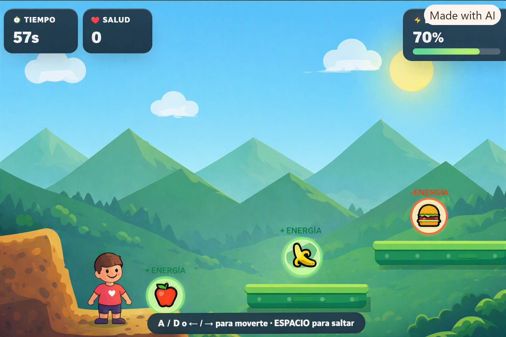

# 🕹️ Nombre del Juego
**Life-Jump**

---

## 🎯 Descripción
**¿De qué trata?**  
Es un juego educativo donde el jugador debera seleccionar las comidas saludables para ganar energia y completar los niveles de plataformeo intentando esquivar toda la comida chatarra posible ya que al tocarlo se perdera energia

**¿Cuál es el objetivo del jugador?**  
El jugador deberá avanzar saltando de plataforma en plataforma, decidir qué alimentos recoger y evitar los que reduzcan su energía. Tendrá que adaptarse a plataformas de diferentes formas, alturas y distancias, administrando su energía para no caer. 

**¿Cuál es la mecánica principal?**  
El jugador debe saltar entre diferentes plataformas y recoger alimentos. Cuando consume un alimento saludable, aumenta su energía, haciendo que sus saltos sean más altos y largos. Si consume comida chatarra, su capacidad de salto disminuye poco a poco. 

---

## 🧩 Género
**Estrategia / Plataformeo / Educacional**

---

## 🎮 Controles
| Acción | Tecla / Botón / Mouse |
|--------|----------------|
| Moverse | `A / D` o `← / →` |
| Saltar | `W` o `↑`|

---

## 📸 Captura del Juego

---

✨ *El juego relaciona directamente la alimentación con el rendimiento del personaje: los alimentos saludables aumentan la energía y mejoran los saltos, mientras que la comida chatarra reduce progresivamente la capacidad de salto. De esta manera, el niño aprende mediante las consecuencias de sus decisiones.*
