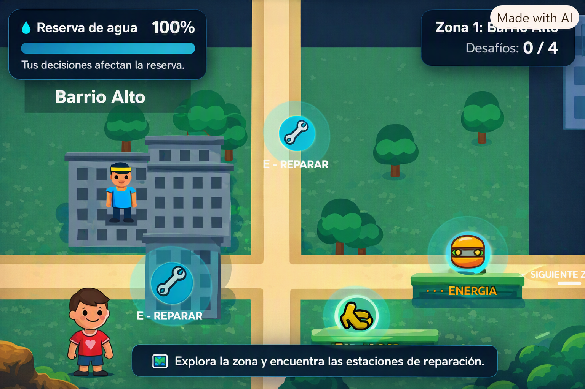

# 🕹️ Nombre del Juego
**Guardianes del Agua**

---

## 🎯 Descripción
**¿De qué trata?**  
Es un juego educativo donde el jugador debera completar distintos minijuegos variados y con dificultad para asi poder reparar la zona y ahorrar el nivel de agua de esa ubicacion. 

**¿Cuál es el objetivo del jugador?**  
Exploración y gestión de recursos: la jugadora recorre diferentes zonas de la ciudad, encuentra problemas relacionados con el agua y debe decidir cómo solucionarlos utilizando recursos limitados. Las decisiones modifican el estado de cada zona. 

**¿Cuál es la mecánica principal?**  
Recuperar progresivamente diferentes zonas de la ciudad y mantenerlas activas, completando misiones, resolviendo problemas y administrando correctamente los recursos disponibles. No se trata simplemente de “ahorrar agua”, sino de conseguir que la ciudad siga funcionando. 

---

## 🧩 Género
**Estrategia/ Puzzle / Memoria / Educacional**

---

## 🎮 Controles
| Acción | Tecla / Botón / Mouse |
|--------|----------------|
| Moverse | `A / D o `← / →|
| Salta | Espacio|
|Seleccionar opcion / Mover las tuberias| Click Izquierdo|

---

## 📸 Captura del Juego

---

✨ *Guardianes del Agua se trata de que si bien el agua funciona como un recurso estratégico, cuando la jugadora consume demasiado en una zona, tendrá menos disponibilidad para otras actividades y deberá buscar alternativas. Si administra bien el recurso, puede desbloquear nuevas áreas, eventos, mejoras y rutas. Además, algunas decisiones producen consecuencias visibles en el entorno.*
