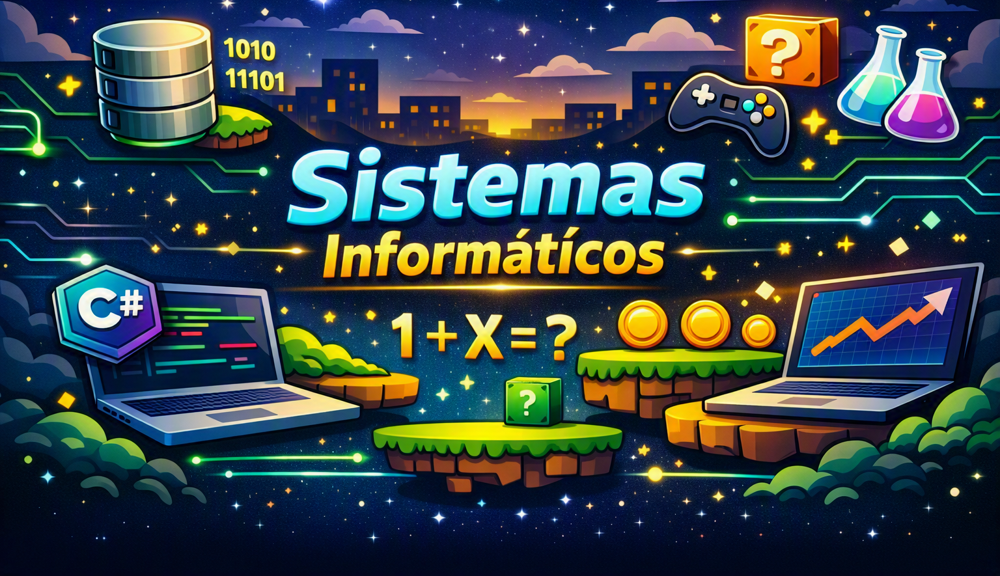
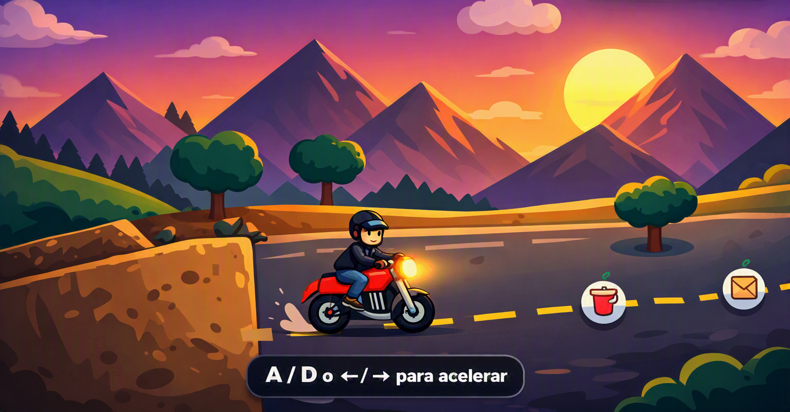
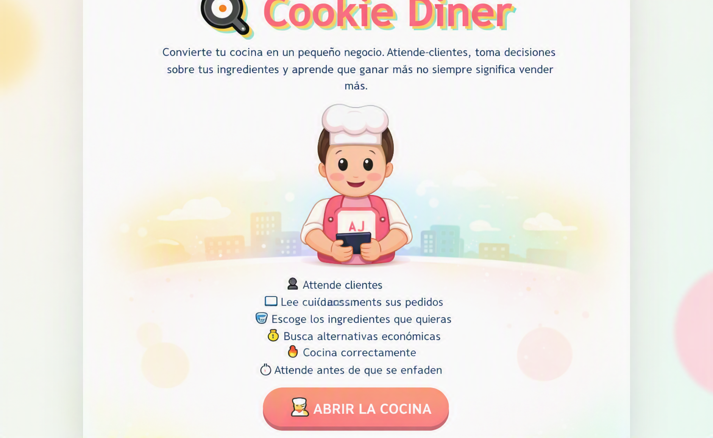

# 👋 Hola, soy Jhoel Alejandro Mauricio Flores Vargas

Estudiante de **Ingeniería de Sistemas Informáticos en Univalle**  
Apasionado por el desarrollo **Backend**, la **optimización de bases de datos** y la creación de **videojuegos**.  

Destaco por mi capacidad analítica y por mi perseverancia para resolver problemas complejos en soluciones simples y eficaces, así como por una alta adaptabilidad para aprender nuevos marcos de trabajo según las necesidades del proyecto. Busco integrarme a un equipo dinámico donde pueda aportar lógica de negocio sólida, continuar fortaleciendo mis habilidades técnicas y blandas, y contribuir al desarrollo de soluciones software de alto impacto.

---

## 🎨 Presentación Visual

---

## 🎮 Mis Juegos

| Proyecto | Descripción | Imagen |
|-----------|--------------|--------|
| Bloquecidio Matemático | Juego educativo de lógica y cálculo |  |
| Fuera de Pantalla| Juego de decisiones y rutas que recapacitan al jugador|  |
| Reci-Trail| Juego de conciencia al cuidado del medio ambiente |  |
| Life-Jump| Juego plataformeo y de comida |  |
| Cookie Diner | Juego de Cocina y de ahorro de dinero |  |
| Gestión de Agua | Simulación de reparaciones y recursos |  |

---

## 🧠 Tecnologías y Herramientas

---

## 📬 Contacto

- 📧 jhoelmauro1995@gmail.com  
- 🧠 [GitHub](https://github.com/Sunnyri11)

---

✨ *Este README funciona como portada de mi portafolio, mostrando mis proyectos, habilidades y estilo visual animado.*
